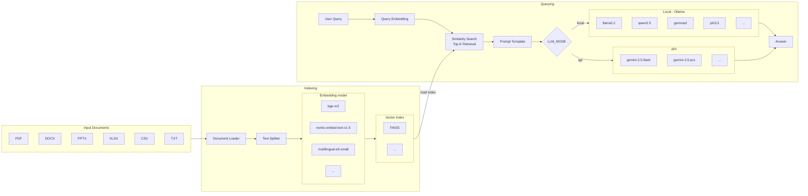
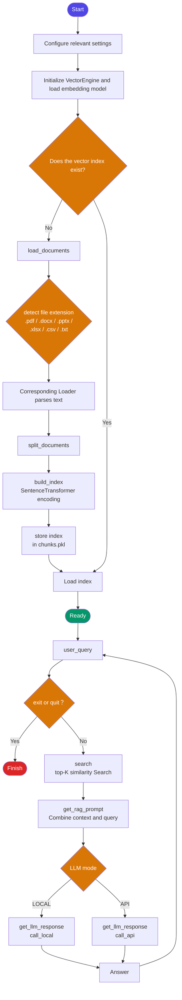

# Quickstart

1. Install dependencies
```
pip install -r requirements.txt
```

2. Set up `.env`

create a `.env` file in the project root directory:

```
#Gemini
LLM_API_KEY=your_api_key
#Groq     
LLM_API_KEY_groq=your_api_key
#GitHub
LLM_github_token=your_access_token
DATA_PATH=test_file          #path to your documents
```

3.  Place your documents

put your files into the `test_file` folder (or whichever folder you set in DATA_PATH).

4. Run `download.py` if you haven't downloaded an embedding model yet.
```
python download.py
```
5. Configure `config.py`
```
LLM_MODE = "local"                                      # "local" or "api"
API_TYPE = "github"                                     # if you choose api, specify "gemini", "groq" or "github"
LOCAL_MODEL = "llama3.2"                                # e.g. llama3.2, qwen2.5, gemma2, phi3.5
API_MODEL_gemini = "gemini-2.5-flash"                   # e.g. gemini-2.5-flash、gemini-2.5-pro
API_MODEL_groq = "llama-3.3-70b-versatile"              # e.g. llama-3.3-70b-versatile、mixtral-8x7b-32768、gemma2-9b-it、meta-llama/llama-4-scout-17b-16e-instruct
API_MODEL_github_model = "gpt-4o"                       # e.g. gpt-4o、o1-mini
                        
embedding_model_name = "intfloat/multilingual-e5-small" # e.g. BAAI/bge-m3, nomic-ai/nomic-embed-text-v1.5

# Chunking & retrieval settings
chunk_size = 500
chunk_overlap = 50
top_k = 5 
```

6. Run
```
python main.py
```
# Notice
While `main.py` is running, you can use the following commands :
* `exit` or `quit`:
  Ends the current session and safely exits the program.
* `quota`:
  Checks the usage status of the API provider:
  * **Groq**: Displays **RPM** and **TPM**, also rate limit descriptions.
  * **Gemini / GitHub Models**: Only provides rate limit descriptions. 
3. The vector index is cached in vector_index/. If you add or change documents, delete the index folder and re-run
# Architecture diagram

# Flowchart

