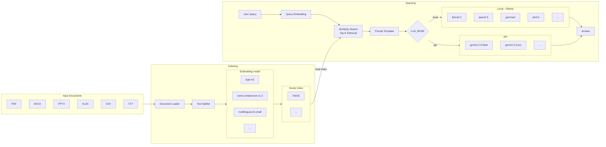

# Quickstart

1. Install dependencies
```
pip install -r requirements.txt
```

2. Set up `.env`

create a `.env` file in the project root directory: <br>
```
LLM_API_KEY=your_api_key     #gemini, ...
DATA_PATH=test_file          #path to your documents
```

3.  Place your documents

put your files into the test_file folder (or whichever folder you set in DATA_PATH).

4. Run 'download.py' if you haven't downloaded an embedding model yet
```
python download.py
```
5. Configure `config.py`
```
LLM_MODE = "local"                                      # "local" or "api"
LOCAL_MODEL = "llama3.2"                                # e.g. llama3.2, qwen2.5, gemma2, phi3.5
API_MODEL = "gemini-2.5-flash"                          # e.g. gemini-2.5-flash, gemini-2.5-pro
embedding_model_name = "intfloat/multilingual-e5-small" # e.g. BAAI/bge-m3, nomic-ai/nomic-embed-text-v1.5

# Chunking & retrieval settings
chunk_size = 500
chunk_overlap = 50
top_k = 5 
```

6. Run
```
python main.py
```
# Notice

The vector index is cached in vector_index/. If you add or change documents, delete the index folder and re-run
# Flowchart

